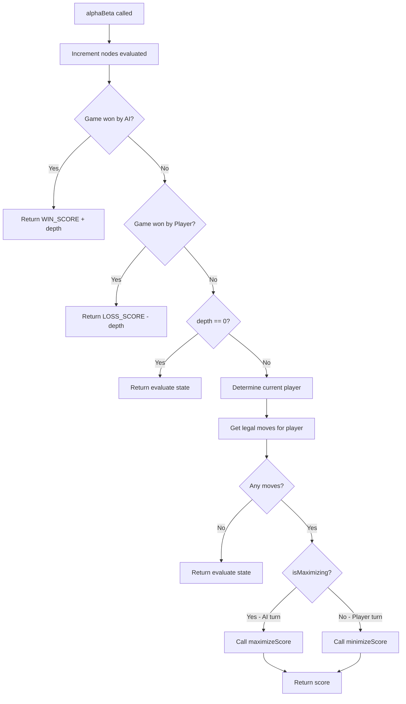

```mermaid
flowchart TD
    A[alphaBeta called] --> B[Increment nodes evaluated]
    B --> C{Game won by AI?}
    C -->|Yes| D[Return WIN_SCORE + depth]
    C -->|No| E{Game won by Player?}
    E -->|Yes| F[Return LOSS_SCORE - depth]
    E -->|No| G{depth == 0?}
    G -->|Yes| H[Return evaluate state]
    G -->|No| I[Determine current player]
    I --> J[Get legal moves for player]
    J --> K{Any moves?}
    K -->|No| L[Return evaluate state]
    K -->|Yes| M{isMaximizing?}
    M -->|Yes - AI turn| N[Call maximizeScore]
    M -->|No - Player turn| O[Call minimizeScore]
    N --> P[Return score]
    O --> P
```
