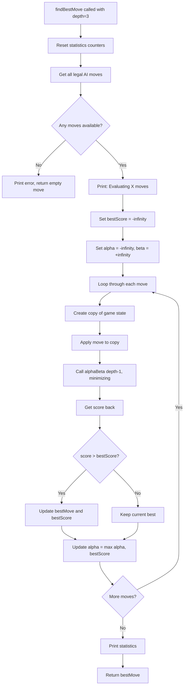

```mermaid
flowchart TD
    A[findBestMove called with depth=3] --> B[Reset statistics counters]
    B --> C[Get all legal AI moves]
    C --> D{Any moves available?}
    D -->|No| E[Print error, return empty move]
    D -->|Yes| F[Print: Evaluating X moves]
    F --> G[Set bestScore = -infinity]
    G --> H[Set alpha = -infinity, beta = +infinity]
    H --> I[Loop through each move]
    I --> J[Create copy of game state]
    J --> K[Apply move to copy]
    K --> L[Call alphaBeta depth-1, minimizing]
    L --> M[Get score back]
    M --> N{score > bestScore?}
    N -->|Yes| O[Update bestMove and bestScore]
    N -->|No| P[Keep current best]
    O --> Q[Update alpha = max alpha, bestScore]
    P --> Q
    Q --> R{More moves?}
    R -->|Yes| I
    R -->|No| S[Print statistics]
    S --> T[Return bestMove]
```
