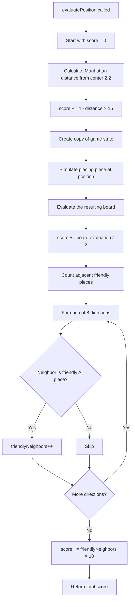

```mermaid
flowchart TD
    A[evaluatePosition called] --> B[Start with score = 0]
    B --> C[Calculate Manhattan distance from center 2,2]
    C --> D[score += 4 - distance × 15]
    D --> E[Create copy of game state]
    E --> F[Simulate placing piece at position]
    F --> G[Evaluate the resulting board]
    G --> H[score += board evaluation / 2]
    H --> I[Count adjacent friendly pieces]
    I --> J[For each of 8 directions]
    J --> K{Neighbor is friendly AI piece?}
    K -->|Yes| L[friendlyNeighbors++]
    K -->|No| M[Skip]
    L --> N{More directions?}
    M --> N
    N -->|Yes| J
    N -->|No| O[score += friendlyNeighbors × 10]
    O --> P[Return total score]
```
