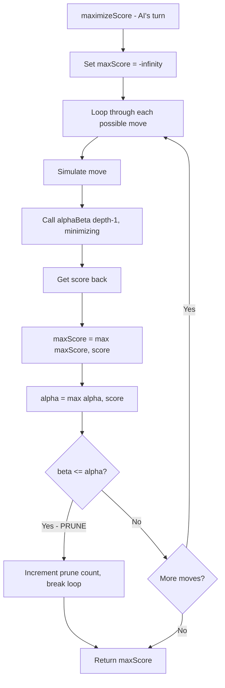

```mermaid
flowchart TD
    A[maximizeScore - AI's turn] --> B[Set maxScore = -infinity]
    B --> C[Loop through each possible move]
    C --> D[Simulate move]
    D --> E[Call alphaBeta depth-1, minimizing]
    E --> F[Get score back]
    F --> G[maxScore = max maxScore, score]
    G --> H[alpha = max alpha, score]
    H --> I{beta <= alpha?}
    I -->|Yes - PRUNE| J[Increment prune count, break loop]
    I -->|No| K{More moves?}
    K -->|Yes| C
    K -->|No| L[Return maxScore]
    J --> L
```
